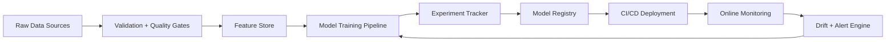

<div align="center">


<p>
  
  
  
  
</p>

<p>
  <a href="#-about-me">About</a> •
  <a href="#-tech-matrix">Tech</a> •
  <a href="#-performance-dashboard">Analytics</a> •
  <a href="#-signature-projects">Projects</a> •
  <a href="#-connect--presence">Connect</a>
</p>

</div>

---

## ✨ About Me

```python
class RockstarProfile:
    def __init__(self):
        self.role = "Data Scientist / ML Engineer"
        self.specialties = ["ML Systems", "NLP", "Computer Vision", "MLOps"]
        self.stack = ["Python", "PyTorch", "TensorFlow", "Docker", "AWS", "GCP"]
        self.current_focus = "Building reliable, production-grade AI products"

    def mission(self):
        return "Transform complex data into clear, high-impact decisions."
```

- 🔭 Engineering end-to-end machine learning products with measurable outcomes
- 🧠 Focused on scalable experimentation, robust evaluation, and reproducible pipelines
- ⚙️ Strong preference for clean architecture, strong baselines, and shipping fast
- 🤝 Collaborating on AI/analytics projects with real user or business impact

---

## 🧰 Tech Matrix

<div align="center">
  
</div>

<div align="center">

| Domain | Tools |
|---|---|
| ML / DL | TensorFlow, PyTorch, scikit-learn, XGBoost |
| Data | Pandas, NumPy, SQL, Feature Engineering |
| Deployment | FastAPI, Docker, Kubernetes, CI/CD |
| Cloud | AWS, GCP |

</div>

---

## 📊 Performance Dashboard

<div align="center">
  
  
  
</div>

<div align="center">
  
  
</div>

<div align="center">
  
</div>

<div align="center">
  
</div>

<div align="center">

| Dashboard Lens | What it highlights |
|---|---|
| 📦 Delivery Velocity | Commit cadence and streak consistency over time |
| 🧠 Technical Breadth | Language mix aligned with data + ML + deployment work |
| 📈 Contribution Momentum | Weekly activity trend and sustained open-source presence |

</div>

---

## 🏆 Elite Badges

<div align="center">
  
</div>

---

## 🐍 Contribution Snake

<div align="center">
  <picture>
    <source media="(prefers-color-scheme: dark)" srcset="https://raw.githubusercontent.com/rockstar1234jd/rockstar1234jd/output/github-contribution-grid-snake-dark.svg" />
    <source media="(prefers-color-scheme: light)" srcset="https://raw.githubusercontent.com/rockstar1234jd/rockstar1234jd/output/github-contribution-grid-snake.svg" />
    
  </picture>
</div>

---

## 🚀 Signature Projects

<div align="center">

| Project | Stack | Impact |
|---|---|---|
| 🧠 DemandSense Forecast Engine | Python, PyTorch, FastAPI | Improved weekly forecast MAPE by **18%** and reduced stockout alerts by **31%** |
| 📈 PulseOps Decision Dashboard | SQL, Pandas, Streamlit | Cut manual reporting effort from **8h to 45m/week** for cross-functional teams |
| 🤖 SupportIQ NLP Copilot | NLP, Transformers, Docker | Automated first-pass ticket triage with **92% routing accuracy** in production |

</div>

---

## 🎯 2026 Focus

- ✅ Build and publish high-quality ML case studies
- ✅ Improve model observability and drift monitoring workflows
- ✅ Contribute to open-source tools in data and AI ecosystem

---

## 🧪 Unique Feature: ML System Blueprint



- 🔁 Feedback-first architecture for continuous model improvement
- 📉 Drift monitoring loop connected directly to retraining workflows
- 🧾 Reproducibility enforced via experiment tracking + versioned artifacts

---

## ⚡ Innovation Radar

<div align="center">
  
  
  
  
</div>

---

## 🌐 Connect & Presence

<div align="center">
  <a href="https://github.com/rockstar1234jd"></a>
  <a href="mailto:rockstar1234jd@users.noreply.github.com"></a>
  <a href="https://www.linkedin.com"></a>
  <a href="https://www.kaggle.com"></a>
  <a href="https://medium.com"></a>
</div>

---

<div align="center">
  
  <h3>"From raw data to real-world impact."</h3>
</div>


